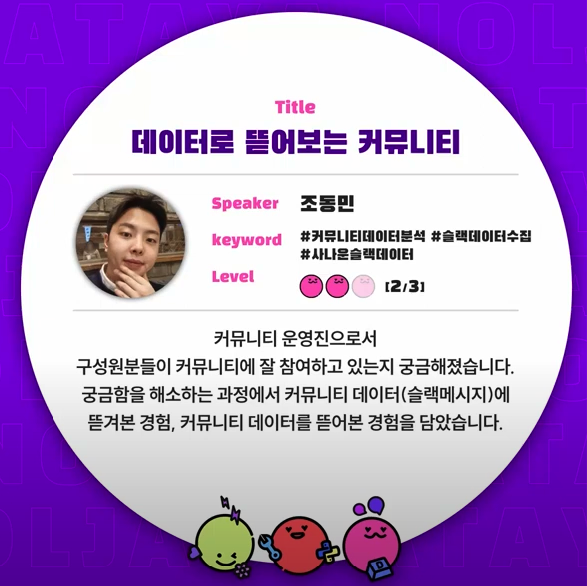
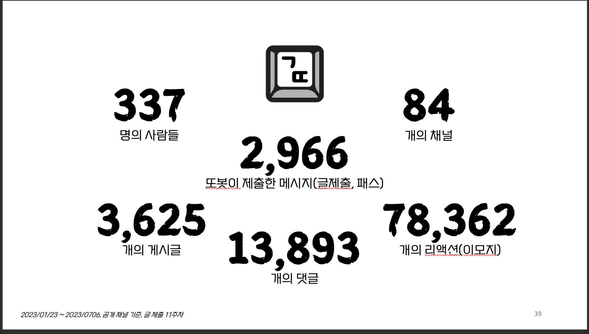

[Table of Contents](#toc)
- [수집 계기](#수집-계기)
- [ETL 프로세스](#etl-프로세스)
- [스키마](#스키마)
- [8기 데이터 기반 시상식 진행](#8기-데이터-기반-시상식-진행)
- [데이터야놀자 발표](#데이터야놀자-발표)
----
# 수집 계기
- [Genie Season1](https://github.com/geultto/genie)
    - 글 제출 / 패스권 / 상호피드백 체킹에 활용
- 수집 범위를 확장하여
    - 글또 내 사용자 활동 로그(게시글, 쓰레드, 이모지)를 수집
    - 커뮤니티 활성화에 이용
# ETL 프로세스
- core폴더에 각 기능들이 정리되어 있고
  - batch폴더 아래의 slack_daily_message_extraction.py에서 각 기능들을 한 곳으로 모아
  - etl_\*.py/message_\*.py에서 실행시키는 구조입니다.
    - `etl_\*.py` - etl 코드입니다.
      - public채널을 수집하거나 혹은 아카이빙용으료 private 채널의 데이터`봇이 채널에 속한 경우만 수집 가능`를 수집합니다.
    - `message_\*.py` - message발송 코드입니다.
- 수집 범위
    - 공개 채널의 게시글, 쓰레드, 이모지
- 배치 단위
    - 일 단위 
    - 다만, 하루가 지나서 댓글이나 이모지가 달리는 경우가 있으므로 적절한 주기로 upsert할 예정
- 프로세스
    1. 유저 리스트 호출 후 덮어쓰기(새로운 유저가 추가될 수 있음)
    2. 채널 리스트 호출 후 덮어쓰기(새로운 채널이 추가될 수 있음)
    3. 수집할 일자 설정
    4. 채널 별로 게시글 / 쓰레드 / 이모지 전처리
    5. 빅쿼리 저장
```
.
├── README.md
├── __pycache__
│   ├── bigquery.cpython-39.pyc
│   └── slack.cpython-39.pyc
├── batch
│   ├── __init__.py
│   ├── __pycache__
│   │   ├── __init__.cpython-310.pyc
│   │   ├── __init__.cpython-39.pyc
│   │   ├── private_message_extractor.cpython-39.pyc
│   │   ├── slack_daily_message_extraction.cpython-310.pyc
│   │   └── slack_daily_message_extraction.cpython-39.pyc
│   ├── private_message_extractor.py
│   └── slack_daily_message_extraction.py
├── core
│   ├── __init__.py
│   ├── __pycache__
│   │   ├── __init__.cpython-39.pyc
│   │   ├── bigquery.cpython-310.pyc
│   │   ├── bigquery.cpython-39.pyc
│   │   ├── config.cpython-39.pyc
│   │   ├── date_operation.cpython-39.pyc
│   │   ├── date_utils.cpython-39.pyc
│   │   └── slack.cpython-39.pyc
│   ├── bigquery.py
│   ├── config.py
│   ├── date_utils.py
│   └── slack.py
├── etl_private_channel.py
├── etl_public_channel.py
├── img
│   ├── award.png
│   ├── community_img.png
│   └── geultto_summary.png
├── message_activity_final.py
├── message_bamboo_review.py
├── message_topuser.py
├── message_udemy_coupon.py
├── message_udemy_review.py
├── message_writing_lecture.py
├── requirements.txt
└── schema
    ├── channels.json
    ├── slack_conversation_master.json
    └── users.json
```
-------
# 스키마
`users`

| 필드 이름| 유형 | 의미 |
| :----------: | :---------: | :----------: |
| user_id    | STRING       | 유저id             |
| real_name    | STRING       | 성명          |
| display_name    | STRING       | 표시이름          |

`channels`

| 필드 이름| 유형 | 의미 |
| :----------: | :---------: | :----------: |
| channel_id    | STRING       | 채널id             |
| channel_name    | STRING       | 채널명          |
| num_member    | INTEGER       | 채널 인원수          |


`slack_conversation_no_partition`

| 필드 이름| 유형 | 의미 |
| :----------: | :---------: | :----------: |
| channel_id    | STRING       | 채널id             |
| message_type    | STRING       | post, thread          |
| post_id    | STRING       | 게시글id(post, thread 동일)          |
| user_id    | STRING       | 유저id          |
| createtime    | DATETIME       | 게시글, 포스트 작성시간          |
| tddate    | DATE       | 게시글, 포스트 작성일자(파티션키)          |
| text    | STRING       | 게시글, 포스트 텍스트          |
| reactions    | STRING       | 이모지이름/이모지체크유저id/체크수          |

----
# 8기 데이터 기반 시상식 진행
* 저장했던 슬랙 데이터를 기반으로 커뮤니티 내에서 소소한 시상식을 진행했습니다. 자세한 내용은 정현님께서 남겨주신 페이지를 참고해주세요. [글또8기결산](https://lunadata.oopy.io/3141280d-3e04-40e8-8f32-833488fe70b2)
----
# 데이터야놀자 발표


* 데이터 반상회에서 발표했던 경험을 바탕으로 데이터야놀자에서도 발표를 진행하게 됐습니다.
* [발표영상링크](https://www.youtube.com/watch?v=Uuy9BSoriag&t=306s&ab_channel=%EB%8D%B0%EC%9D%B4%ED%84%B0%EC%95%BC%EB%86%80%EC%9E%90)
* [발표자료링크](https://drive.google.com/file/d/1n36-DOJ8Q6vv99ib3RKa9rt_p7vH9SVX/view?usp=sharing)
* 주요 내용은 아래 두 가지입니다.
    * 글또 슬랙 데이터를 수집한 경험
    * 수집한 데이터를 가지고 커뮤니티를 데이터로 뜯어본 경험을 담았습니다.
* 글또에 참여하시는 분들은
    * 지난 커뮤니티 활동을 되돌아보시고
    * 커뮤니티 내에서 본인의 활동량을 확인해보고
    * 추후 활동에서 어떤 목표를 가져볼지 생각해보시면 좋을 것 같습니다.
* 글또에 참여하시지 않는 분들도
    * 사이드 프로젝트를 어떤 동기로 시작해서 어떻게 마무리할지,
    * 혹은 활동하시는 커뮤니티 내에서 유저의 활동을 어떻게 정량화 할지 등에 대한 힌트를 얻어 가실 수 있을 것 같습니다.
